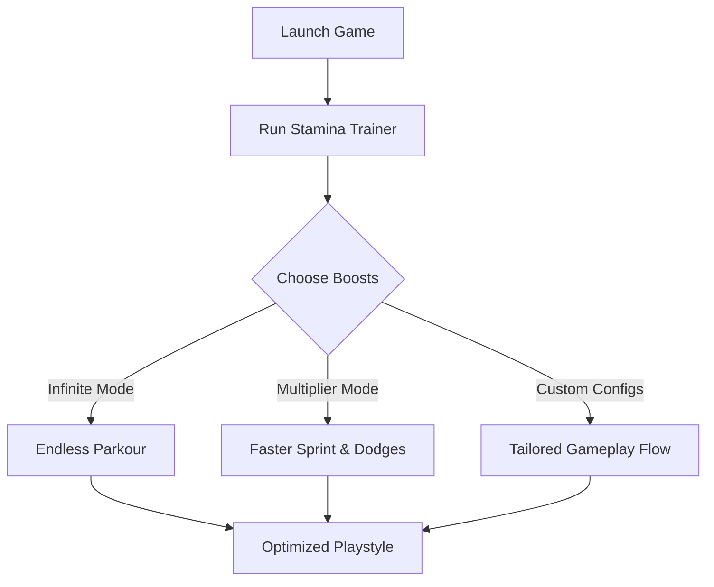

# Dying Light: The Beast Stamina Boosts ⚡🏃

The **Dying Light: The Beast Stamina Boosts Trainer** is tailored for players who love nonstop parkour, fluid combat, and extended exploration. With adjustable stamina multipliers and unlimited endurance toggles, you’ll never have to worry about running out of breath mid-chase or while vaulting rooftops.

Perfect for survivors who want to experience Harran’s vertical playground at full speed.

---

## 📖 Overview

In *Dying Light: The Beast*, stamina governs everything: sprinting, climbing, dodging, and melee attacks. While realism adds intensity, stamina limits can sometimes slow down the thrill of fluid gameplay. This trainer removes those barriers with **stamina-focused enhancements**, letting you chain wall runs, leap attacks, and combos endlessly.

[!NOTE]
Designed for **offline/single-player freedom**. Do not use in online or competitive modes.


---

## 🛠 Features

* **Infinite Stamina** – Never tire during parkour or combat.
* **Sprint Multiplier** – Increase running speed beyond normal caps.
* **Endurance Boost Toggle** – Extend stamina bar capacity by 2x–10x.
* **Melee Combo Freedom** – Swing endlessly without draining energy.
* **Wall-Run Extension** 🧗 – Stay on vertical surfaces longer.
* **Custom Configs** – Tweak stamina drain rates to your preference.
* **Hotkey Activation** – Quick toggles via F1–F6 keys.

---

[](#)
[](#)
[](#)
[](#)

---

## 💻 Compatibility

| Platform       | Status         | Notes                               |
| -------------- | -------------- | ----------------------------------- |
| Windows 10/11  | ✅ Full Support | Steam & Epic versions confirmed     |
| Steam Deck     | ⚠️ Partial     | Proton required, tweaks recommended |
| Linux (Proton) | ⚠️ Partial     | Some multipliers may glitch         |
| Consoles       | ❌ Unsupported  | PC-exclusive trainer                |

[!IMPORTANT]
Always launch the game first, then run the stamina trainer for smooth injection.

---

## ⚡ Setup Guide

1. **Download & extract** the stamina trainer package.
2. Start *Dying Light: The Beast*.
3. Run `DLBeast_StaminaBoosts.exe` as Administrator.
4. Press `Insert` to open the overlay.
5. Use hotkeys or the GUI sliders to customize stamina values.

```ini
[StaminaBoosts]
InfiniteStamina=F1
SprintMultiplier=2.5
EnduranceCap=10x
WallRunExtension=Enabled
```

---

## 📊 Stamina Flow Diagram



---

## ❓ FAQ

**Q: Can I combine stamina boosts with other cheats?**
A: Yes, works seamlessly with health, loot, and combat trainers.

**Q: Does infinite stamina affect immersion?**
A: You can choose between realistic multipliers or full infinite mode.

**Q: Will it work with DLC areas?**
A: Fully supported across all story and expansion zones.

**Q: Can I assign hotkeys to a controller?**
A: Yes, via external key-mapping software.

**Q: Is it updated regularly?**
A: Yes, maintained alongside Beast updates for full compatibility.

---

## 🎯 Final Thoughts

The **Dying Light: The Beast Stamina Boosts Trainer** is the ultimate upgrade for freerunners. By removing endurance limits, you’ll enjoy pure parkour freedom, faster escapes, and smoother combat chains. Perfect for players who thrive on speed and agility.

[](#)
[](#)
[](#)

---
